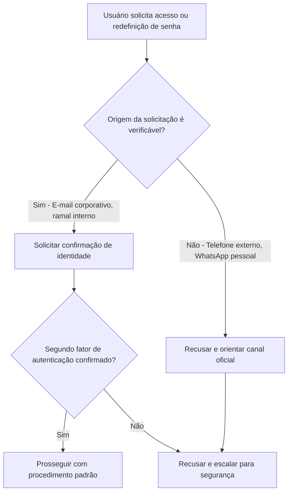
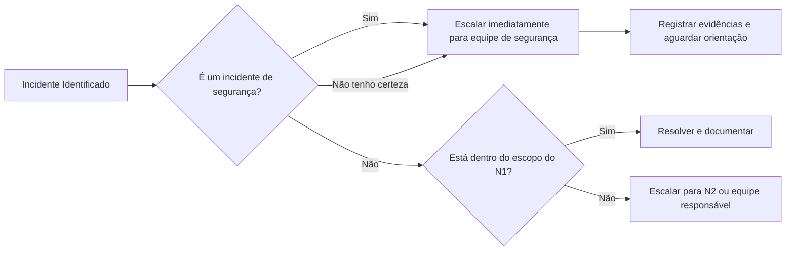

# Segurança da Informação no Suporte Nível 1: Cuidados Essenciais que Todo Profissional Deve Ter

O suporte nível 1 é a porta de entrada da TI. É o primeiro contato do usuário com a área técnica e, justamente por isso, também é a primeira linha de defesa, ou a primeira brecha, quando o assunto é segurança da informação.

Diferente do que muitos pensam, os maiores riscos não vêm apenas de ataques sofisticados. Vêm de pequenos deslizes no dia a dia: uma senha anotada no post-it, uma informação sensível compartilhada sem verificação, um pendrive suspeito conectado por pressa. O suporte nível 1 lida com tudo isso diariamente.

Este artigo reúne os cuidados fundamentais de segurança que todo profissional de help desk e service desk deve incorporar na rotina.

## 1. Engenharia Social: O Inimigo Está do Outro Lado da Linha

O ataque mais comum contra o suporte não é técnico, é psicológico. A engenharia social explora a confiança e a boa vontade do atendente para obter acessos, senhas ou informações privilegiadas.

**Cuidados essenciais:**

- Nunca redefina senhas ou libere acessos apenas com base em uma ligação telefônica. Sempre valide a identidade do solicitante por um segundo canal, como e-mail corporativo, ramal confirmado ou ferramenta de autenticação.
- Desconfie de urgência excessiva. Frases como "meu gerente está me cobrando" ou "preciso disso agora para uma reunião" são gatilhos clássicos de engenharia social.
- Não revele informações sobre a infraestrutura interna, nomes de servidores, versões de sistemas ou colegas da equipe para quem está do outro lado da linha.
- Se algo parecer estranho, pare. Consulte um colega sênior ou a equipe de segurança antes de prosseguir.

## 2. Senhas e Credenciais: Jamais Peça, Jamais Anote

O suporte nível 1 frequentemente auxilia usuários com problemas de login. Esse é um dos momentos de maior exposição.

**Cuidados essenciais:**

- Nunca pergunte a senha do usuário, mesmo que seja "só para testar". A senha é pessoal e intransferível. Utilize ferramentas de reset de senha ou acesso administrativo temporário.
- Oriente o usuário a digitar a senha apenas quando estiver pronto, e jamais a dite em voz alta, seja no telefone, seja presencialmente.
- Não mantenha listas de senhas em planilhas, blocos de notas, post-its ou aplicativos de mensagens.
- Utilize sempre gerenciadores de senhas corporativos para credenciais de serviço compartilhadas. Nada de "senha123" para a conta genérica do setor.
- Ao resetar uma senha, force a troca no próximo login e oriente o usuário a criar uma senha forte: longa, com maiúsculas, minúsculas, números e caracteres especiais.

## 3. Compartilhamento de Informações: Nem Tudo Pode Ser Dito

A LGPD e as políticas internas de segurança existem por um motivo: dados vazados custam caro, em multas, em reputação e em confiança.

**Cuidados essenciais:**

- Não compartilhe informações de um usuário com outro. "Fulano está com o mesmo problema" pode parecer inofensivo, mas expõe dados que não deveriam circular.
- Não encaminhe prints de tela, logs ou mensagens de erro que contenham dados pessoais, CPF, e-mails ou informações financeiras sem antes anonimizá-los.
- Em grupos de WhatsApp ou Telegram da equipe, evite expor detalhes de chamados que identifiquem usuários específicos. Prefira os canais oficiais da ferramenta de ITSM.
- Ao compartilhar a tela em uma sessão remota, feche abas, notificações e aplicativos pessoais antes de iniciar o compartilhamento.

## 4. Dispositivos e Mídias Removíveis: O Pendrive do Desconhecido

Quantas vezes o suporte já recebeu um pendrive de um usuário dizendo "formata isso aqui para mim"? Esse gesto simples pode ser a porta de entrada para um malware.

**Cuidados essenciais:**

- Nunca conecte mídias removíveis de origem desconhecida ou não verificada na estação de trabalho, nem no computador pessoal, nem no corporativo.
- Utilize uma máquina isolada ou ambiente sandbox para manipular mídias de terceiros, quando isso for absolutamente necessário.
- Mantenha o antivírus atualizado e configure a varredura automática de dispositivos USB.
- Oriente os usuários a não utilizarem pendrives pessoais em equipamentos corporativos sem autorização prévia.

## 5. Acesso Remoto: Ferramenta Poderosa, Risco Proporcional

Softwares como AnyDesk, TeamViewer, Quick Assist e RDP são o braço direito do suporte remoto. Mas uma sessão mal conduzida pode expor dados, credenciais e até abrir portas para acesso não autorizado.

**Cuidados essenciais:**

- Sempre inicie a sessão remota a partir de uma solicitação formal do usuário. Jamais acesse uma máquina sem o consentimento explícito e informado.
- Avise o usuário sobre o que você fará durante o acesso e peça que ele acompanhe a sessão.
- Ao finalizar, encerre completamente a conexão e certifique-se de que nenhuma sessão ficou aberta em segundo plano.
- Não salve credenciais de acesso remoto nos softwares. Cada sessão deve ser iniciada com autenticação nova.
- Ferramentas de acesso remoto não corporativas (como versões gratuitas de AnyDesk) não devem ser utilizadas em ambiente empresarial. Use apenas as soluções homologadas pela equipe de TI.
## 6. Registro e Documentação: O que Não Está Escrito Não Aconteceu

Do ponto de vista de segurança, documentar não é burocracia, é proteção. Um chamado bem documentado é a melhor defesa contra alegações de falha de procedimento.

**Cuidados essenciais:**

- Registre tudo no sistema de chamados: quem solicitou, o que foi feito, quais credenciais foram utilizadas (se aplicável), horário de início e fim do atendimento.
- Descreva com clareza as etapas executadas. Se um acesso administrativo foi usado, detalhe o motivo e a duração.
- Se um incidente de segurança for identificado, como phishing, comportamento suspeito ou acesso indevido, registre imediatamente e escale conforme o procedimento da empresa.
- Não apague logs, prints ou evidências. Eles podem ser cruciais em uma investigação posterior.

## 7. Escalação de Incidentes: Saber Quando Parar é Tão Importante Quanto Saber Resolver

O suporte nível 1 não precisa, e não deve, resolver tudo sozinho. Reconhecer os limites da própria atuação é um dos maiores sinais de maturidade profissional em segurança.

**Sinais de alerta que exigem escalação imediata:**

- Usuário relata ter clicado em link suspeito ou ter fornecido senha por telefone.
- Comportamento anômalo na máquina: arquivos sendo renomeados sozinhos, lentidão extrema repentina, pop-ups de segurança falsos.
- Tentativas repetidas de login com credenciais erradas vindas de um mesmo IP ou usuário.
- Solicitação de acesso a sistemas ou pastas de rede fora do escopo normal daquele colaborador.
- Qualquer menção a ransomware, sequestro de dados ou mensagem de resgate na tela do usuário.

A regra é simples: na dúvida, escale. Um falso alarme incomoda menos do que um incidente real ignorado.

## 8. Postura Pessoal e Ambiente de Trabalho

Segurança também passa pelo comportamento individual e pelo cuidado com o ambiente físico.

**Cuidados essenciais:**

- Bloqueie a estação de trabalho sempre que se ausentar, mesmo que por poucos minutos. `Win + L` é seu melhor atalho.
- Não deixe crachá, token ou celular corporativo desacompanhados sobre a mesa.
- Evite discutir detalhes de chamados ou incidentes em áreas comuns como corredores, elevadores e refeitórios.
- Mantenha seu próprio sistema operacional e aplicativos atualizados. O suporte que cuida dos outros não pode ser o elo frágil da corrente.
- Separe vida pessoal da profissional: não acesse e-mails corporativos em dispositivos pessoais sem proteção adequada, e vice-versa.

## Resumo Visual

| Área de Risco | Principais Cuidados |
|---|---|
| **Engenharia Social** | Validar identidade por segundo canal, desconfiar de urgência, não revelar dados internos |
| **Senhas** | Nunca pedir a senha do usuário, forçar troca no próximo login, usar gerenciador de senhas |
| **Dados e LGPD** | Não compartilhar informações entre usuários, anonimizar logs e prints |
| **Mídias Removíveis** | Não conectar pendrives desconhecidos, usar sandbox, antivírus ativo |
| **Acesso Remoto** | Consentimento explícito, encerrar sessão completamente, usar apenas ferramentas homologadas |
| **Documentação** | Registrar tudo no sistema de chamados, descrever cada etapa executada |
| **Escalação** | Phishing, comportamento anômalo e acessos suspeitos devem ser escalados imediatamente |
| **Postura Pessoal** | Bloquear estação ao sair, não discutir chamados em público, manter sistemas atualizados |

O suporte nível 1 não é apenas a primeira resposta técnica, é o primeiro filtro de segurança da organização. Um profissional bem treinado e vigilante pode impedir que um incidente simples se transforme em um desastre corporativo.

Segurança da informação não é responsabilidade exclusiva do time de cybersecurity. É responsabilidade de todo mundo que senta em frente a uma estação de trabalho, e o suporte, que lida com dezenas de pessoas todos os dias, tem um papel multiplicador nisso. Cada orientação correta dada a um usuário é uma pequena vitória na proteção da empresa.

*Artigo escrito para profissionais de suporte nível 1, help desk e service desk.*
