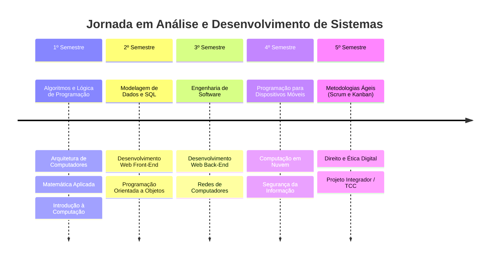
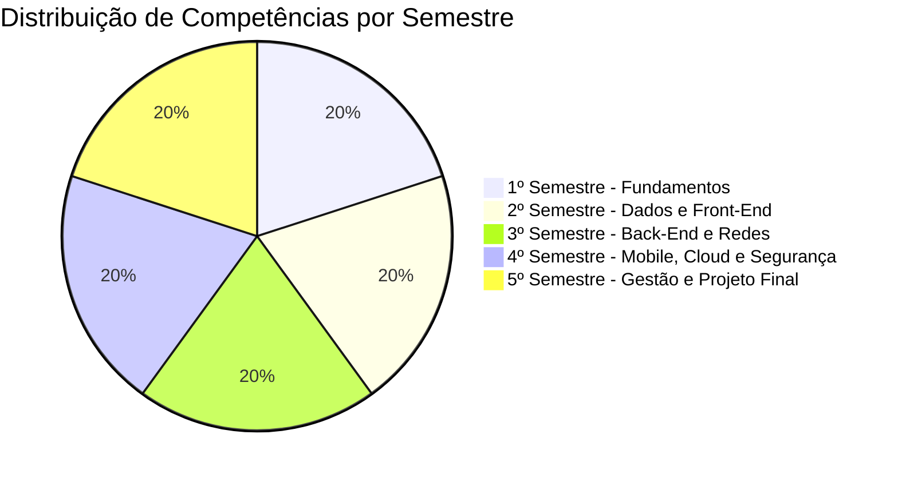
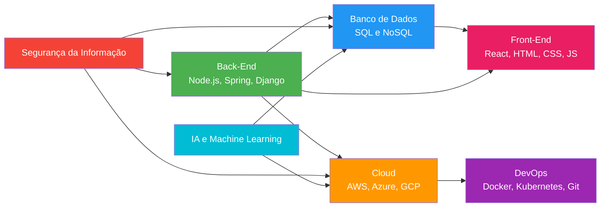
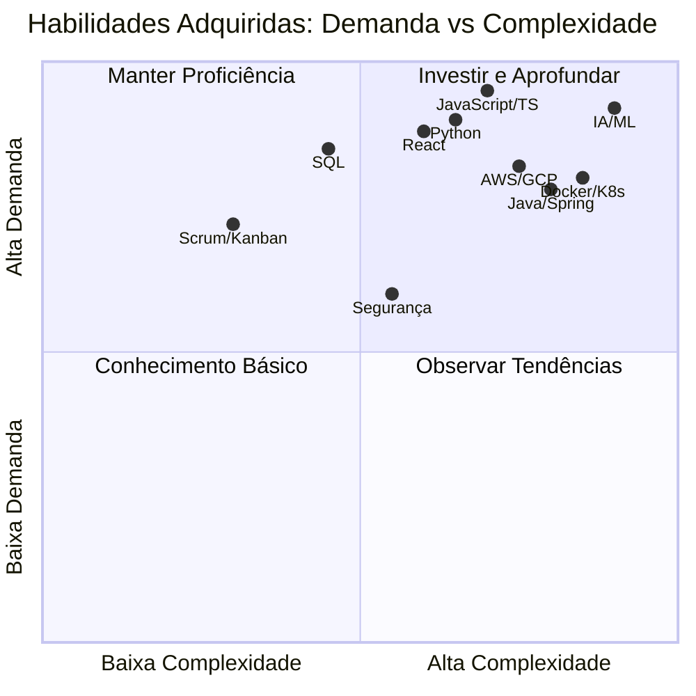

# Do "Hello World" ao Projeto Integrador: Minha Trajetória no Curso de Análise e Desenvolvimento de Sistemas na Anhanguera

Ingressar no curso superior de tecnologia em **Análise e Desenvolvimento de Sistemas** na Anhanguera foi uma decisão estratégica, daquelas que a gente toma sabendo que o mercado de tecnologia não espera por ninguém.

Com apenas 2 anos e meio de duração, divididos em 5 semestres intensos, o curso prometia uma formação acelerada e focada nas tecnologias que o mercado realmente demanda — nada de perder tempo com disciplinas desconectadas da realidade profissional.

Hoje, caminhando para a reta final, posso dizer com segurança: a jornada superou as expectativas. O que parecia apenas um tecnólogo se transformou em uma imersão prática em desenvolvimento, dados, cloud e inteligência artificial. Cada semestre trouxe um degrau novo, e é sobre essa caminhada que eu quero falar aqui.

## Primeiro Semestre: Construindo as Bases

Tudo começou com os fundamentos, aquela base que ninguém vê, mas que sustenta tudo o que vem depois.

Em **Algoritmos e Lógica de Programação**, descobri que programar não é decorar comandos ou sintaxes — é aprender a pensar de forma estruturada para resolver problemas. Foi nessa disciplina que entendi o valor de dividir um problema grande em partes menores, de traçar fluxos antes de abrir o editor de código. Essa forma de raciocinar se provou a habilidade mais valiosa de todo o curso e, sinceramente, de toda a carreira.

Paralelamente, **Arquitetura de Computadores** e **Introdução à Computação** me deram uma visão ampla de como o hardware e o software operam juntos. Entender o que acontece dentro da máquina quando um programa é executado — memória, processador, barramentos — mudou minha relação com o código. Deixei de ver o computador como uma caixa preta e passei a enxergá-lo como um ecossistema de componentes que trabalham em sincronia.

A disciplina de **Matemática Aplicada** refinou meu raciocínio lógico, habilidade que se mostrou indispensável nos semestres seguintes. Lógica booleana, matrizes e funções deixaram de ser abstrações escolares para se tornar ferramentas cotidianas de debugging e otimização.

Foi um semestre de descoberta. Um semestre que, olhando em retrospecto, plantou as sementes de tudo que eu colheria dali para frente.

## Segundo Semestre: Dando Vida aos Dados e à Web

O segundo semestre marcou meu primeiro contato real com desenvolvimento. O abstrato começou a ganhar forma na tela.

Em **Modelagem de Dados e Banco de Dados**, aprendi a importância de armazenar e organizar informações com SQL. Descobri que nenhum sistema sobrevive sem dados bem estruturados e que um banco mal modelado pode custar caro — em desempenho, em manutenção e em sanidade mental. MER, DER, normalização e consultas complexas se tornaram parte do meu vocabulário técnico.

Paralelamente, a disciplina de **Desenvolvimento Web Front-End** me apresentou ao HTML, CSS e JavaScript. Ver uma página ganhar forma no navegador foi a primeira grande recompensa visual do curso. Sair do terminal preto para um layout colorido no Chrome foi um marco. Entendi ali que a experiência do usuário importa tanto quanto a lógica que roda por trás.

Já **Programação Orientada a Objetos** consolidou uma forma de organizar código que hoje aplico em Python, Java e TypeScript. Herança, polimorfismo, encapsulamento e abstração deixaram de ser conceitos de livro para se tornar padrões naturais de pensamento na hora de arquitetar soluções.

Esse gráfico não está dividido em fatias iguais por acaso: o curso foi desenhado para que cada semestre tenha peso equivalente na formação, construindo camada sobre camada de conhecimento.

## Terceiro Semestre: Entendendo o que Roda por Trás

Com a base sólida do front-end e dos bancos de dados, mergulhei de cabeça no back-end. Foi o momento de virar a chave e entender o que acontece do lado do servidor.

**Desenvolvimento Web Back-End** me colocou em contato direto com a lógica que processa requisições, autentica usuários e gerencia regras de negócio. Implementar APIs RESTful, trabalhar com autenticação JWT e conectar sistemas foi o salto que transformou meu conhecimento fragmentado em visão de produto completo.

**Engenharia de Software** ampliou minha perspectiva sobre planejamento, documentação e o ciclo de vida dos sistemas — muito além de simplesmente escrever código. Aprendi sobre requisitos funcionais e não funcionais, sobre a importância de um bom levantamento antes da primeira linha de código e sobre como a comunicação clara evita retrabalho.

E **Redes de Computadores** desvendou como os sistemas se comunicam, do protocolo TCP/IP até a arquitetura cliente-servidor. Entender latência, DNS, roteamento e os modelos OSI e TCP/IP me deu uma vantagem real na hora de debugar problemas de conexão e projetar aplicações distribuídas.

Esse semestre foi o ponto de virada. Saí dele enxergando sistemas como organismos vivos, com front-end, back-end, banco e rede conversando entre si.

## Quarto Semestre: Explorando Tecnologias Avançadas

Foi aqui que o horizonte se expandiu de vez. O quarto semestre trouxe as tecnologias que definem o presente e o futuro do mercado de tecnologia.

**Programação para Dispositivos Móveis** me introduziu ao desenvolvimento mobile, uma área que não para de crescer. Aprender a pensar em telas pequenas, gestos touch, consumo otimizado de APIs e experiência mobile-first foi um exercício de empatia com o usuário que carrega o sistema no bolso.

**Computação em Nuvem** revelou o poder de hospedar sistemas em AWS, Azure e GCP, eliminando barreiras de infraestrutura. Entender conceitos como IaaS, PaaS e SaaS, escalabilidade automática e serverless mudou completamente minha visão sobre deploy e manutenção de aplicações. Por que comprar servidores quando você pode alugar capacidade sob demanda?

E **Segurança da Informação** trouxe uma lição que levo para a vida: de nada adianta um sistema funcional se ele não for seguro. Vulnerabilidades como SQL Injection, XSS e CSRF deixaram de ser termos distantes para se tornar ameaças reais que todo desenvolvedor precisa saber mitigar. A tríade CIA — Confidencialidade, Integridade e Disponibilidade — se tornou meu checklist mental em cada projeto.

O diagrama acima mostra como os pilares da formação se conectam. Nenhuma tecnologia vive isolada. O back-end depende do banco, que depende da nuvem, que depende da segurança, e tudo isso entrega valor através do front-end. Essa visão integrada é o que diferencia um profissional completo de um especialista limitado.

## Quinto Semestre: Gestão, Ética e o Projeto Final

Chegando à reta final, o foco se voltou para o mercado de forma prática e madura. Não bastava mais saber programar — era hora de aprender a entregar valor em equipe.

**Metodologias Ágeis** me ensinou Scrum e Kanban na prática. Aprendi a diferença entre uma sprint bem planejada e um backlog abandonado. Daily meetings, retrospectivas, planning poker e quadros kanban deixaram de ser jargões corporativos para se tornar ferramentas reais de produtividade. Hoje entendo que metodologia ágil não é sobre fazer mais rápido — é sobre fazer o que realmente importa, com transparência e adaptação contínua.

**Direito e Ética Digital** trouxe reflexões importantes sobre LGPD, privacidade e o uso responsável dos dados. Em um mundo onde dados são o novo petróleo, entender os limites legais e éticos do seu uso não é diferencial — é obrigação. Consentimento, finalidade, necessidade e transparência se tornaram parte do meu checklist de desenvolvimento.

Por fim, o **Projeto Integrador / TCC** representa a conclusão de tudo: um projeto real que sintetiza cada tecnologia, cada conceito e cada habilidade que desenvolvi ao longo desses cinco semestres. É a oportunidade de aplicar, em um único entregável, o que aprendi sobre front-end, back-end, banco de dados, cloud, segurança e metodologias ágeis. É o cartão de visitas que levarei para o mercado.

Esse gráfico de quadrantes posiciona as tecnologias da grade conforme a demanda do mercado e a complexidade de domínio. As que estão no quadrante superior direito — como IA, containers e linguagens modernas — merecem investimento contínuo. As do quadrante superior esquerdo, como SQL e metodologias ágeis, devem ser mantidas em proficiência. É um mapa visual para orientar os próximos passos da carreira.

## O que Levo Dessa Trajetória

| Competência | Tecnologias e Abordagens |
|---|---|
| **Linguagens** | Python, Java, JavaScript, TypeScript, SQL |
| **Front-End** | HTML, CSS, React |
| **Back-End** | Node.js, Spring, Django |
| **Banco de Dados** | SQL, NoSQL |
| **DevOps e Cloud** | Git, Docker, Kubernetes, AWS, Azure, GCP |
| **Inteligência Artificial** | Fundamentos de IA e machine learning |
| **Metodologias** | Scrum, Kanban |
| **Segurança e Ética** | Segurança da informação, LGPD |

A Anhanguera me entregou mais do que um diploma reconhecido pelo MEC: entregou uma formação alinhada com um mercado que tem mais de 700 mil vagas abertas no Brasil.

Com uma grade que combina fundamentos sólidos e tecnologias de ponta — atualizada para 2026 com Python, IA aplicada, cloud computing e containers — encerro essa etapa preparado para atuar como desenvolvedor e analista de sistemas.

A jornada acadêmica termina, mas a de aprendizado contínuo está apenas começando. Se tem uma coisa que esses cinco semestres me ensinaram é que, em tecnologia, a única constante é a mudança. E eu estou pronto para ela.

*Zayan Teixeira Correa — Concluinte do curso de Análise e Desenvolvimento de Sistemas (Tecnólogo) na Anhanguera.*
