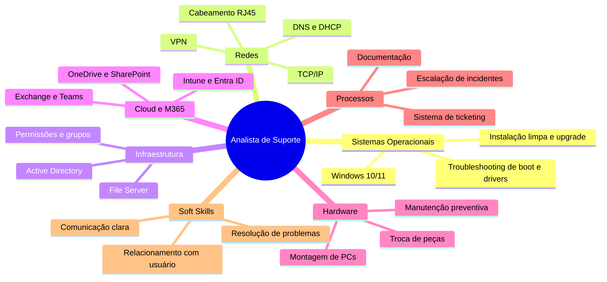

# Do Curso de ADS para o Mercado: Como Minha Formação me Prepara para Vagas de Suporte Técnico

Estou concluindo o curso de Análise e Desenvolvimento de Sistemas na Anhanguera e, nas últimas semanas, tenho analisado dezenas de vagas de suporte técnico. O que mais me chamou a atenção foi perceber que, semestre após semestre, o curso me entregou exatamente as competências que essas oportunidades pedem.

Não estou falando de teoria distante da prática. Estou falando de disciplinas que simulam o dia a dia real de um analista de suporte: configurar sistemas operacionais, gerenciar usuários no Active Directory, diagnosticar problemas de rede, documentar chamados e, acima de tudo, resolver problemas com agilidade e clareza.

Este artigo é um resumo de como minha formação se conecta com o que o mercado está pedindo hoje.

## O que as Vagas Pedem, e o que Eu Já Domino

Analisei vagas de analista de suporte, field service, suporte N1/N2 e suporte M365. Abaixo, os requisitos mais recorrentes e como cada um foi abordado durante o curso.

| Requisito | Ocorrências (em 5 vagas) | Frequência |
|---|---|---|
| Suporte a Windows | 5 | ████████████████████ 100% |
| Redes (TCP/IP, DNS, DHCP) | 5 | ████████████████████ 100% |
| Comunicação e resolução de problemas | 4 | ████████████████ 80% |
| Active Directory | 3 | ████████████ 60% |
| Microsoft 365 | 3 | ████████████ 60% |
| Manutenção de hardware | 3 | ████████████ 60% |
| Sistema de ticketing | 2 | ████████ 40% |
| VPN | 2 | ████████ 40% |
| SQL básico | 1 | ████ 20% |
### Windows Desktop (10/11): Instalação, Configuração e Troubleshooting

Esse é o requisito mais comum, presente em praticamente todas as vagas que vi. A boa notícia é que o suporte ao Windows não é novidade para mim.

Durante o curso, lidei com instalação e configuração de sistemas operacionais desde as disciplinas introdutórias de Arquitetura de Computadores. Aprendi sobre particionamento de disco, instalação limpa versus upgrade, gerenciamento de drivers, configuração de perfis de usuário e resolução de problemas como tela azul, falhas de boot e conflitos de hardware.

Além da faculdade, sempre fui a pessoa que familiares e amigos procuram quando o computador dá problema. Essa experiência informal me ensinou algo que não está nos livros: paciência para explicar soluções em linguagem simples e método para isolar a causa raiz antes de sair aplicando correções aleatórias.
### Redes de Computadores: TCP/IP, DNS, DHCP e VPN

A disciplina de Redes de Computadores, cursada no terceiro semestre, foi um divisor de águas. Entender o modelo TCP/IP, a função do DNS na resolução de nomes, a atribuição dinâmica de IPs via DHCP e o funcionamento de uma VPN deixou de ser abstração teórica.

Sei diagnosticar problemas de conectividade usando comandos como `ping`, `tracert`, `ipconfig /release` e `ipconfig /renew`. Entendo a diferença entre um problema de IP conflitante e uma falha de resolução DNS. Sei que quando o usuário diz "a internet caiu", a primeira coisa a verificar é se o cabo de rede está conectado e se o DHCP atribuiu um endereço válido.

Para as vagas que pedem noções de cabeamento e ativação de ponto de rede, também me sinto preparado. Aprendi sobre cabos UTP, conectores RJ45, padrão T568A e T568B e a importância de um cabeamento bem feito na qualidade da conexão.

### Active Directory e File Server: Gerenciando Usuários e Permissões

O Active Directory aparece em várias vagas como requisito obrigatório. Embora o AD não seja uma disciplina isolada na grade do curso, os conceitos de gerenciamento de usuários, grupos e permissões foram amplamente abordados nas disciplinas de Sistemas Operacionais e Segurança da Informação.

Entendo a estrutura de Unidades Organizacionais, a diferença entre grupos de segurança e grupos de distribuição, e como aplicar o princípio do menor privilégio na concessão de acessos. Sei que permissões de pasta no File Server seguem uma hierarquia e que um erro de configuração pode tanto expor dados sigilosos quanto bloquear o trabalho de um setor inteiro.

A disciplina de Segurança da Informação reforçou esses conceitos com um enfoque prático: confidencialidade, integridade e disponibilidade não são apenas palavras bonitas, são critérios que aplico toda vez que configuro um acesso.

### Microsoft 365: Exchange, Teams, SharePoint e OneDrive

As vagas de suporte M365 pedem conhecimento em Exchange (gerenciamento de caixas postais, listas de distribuição), Teams (criação de equipes, canais, configuração de reuniões), SharePoint (bibliotecas de documentos, permissões de site) e OneDrive (sincronização, compartilhamento de arquivos).

Tenho familiaridade com o ecossistema Microsoft 365 como usuário e como administrador básico. Entendo o fluxo de migração de ambientes on-premises para a nuvem, a integração entre as ferramentas e os principais pontos de falha que geram chamados: conflitos de sincronização do OneDrive, problemas de autenticação no Teams e erros de permissão no SharePoint.

O Intune e o Entra ID, citados em uma das vagas, foram abordados nas disciplinas de Computação em Nuvem. Sei que o Intune gerencia dispositivos e políticas de segurança, enquanto o Entra ID cuida da identidade e do controle de acesso no Azure.

### Manutenção de Hardware: Montagem, Upgrade e Diagnóstico

Formatar, montar, trocar peças e diagnosticar falhas de hardware são atividades que constam em boa parte das vagas. Tenho prática com montagem de desktops, instalação de memória RAM, troca de coolers, substituição de baterias e upgrades de HD para SSD.

Aprendi na faculdade a diferença entre manutenção preventiva e corretiva. Sei que prevenir é mais barato que corrigir e que uma limpeza periódica dos componentes evita superaquecimento e prolonga a vida útil do equipamento.

Para vagas de field service, que exigem deslocamento até o cliente, entendo que o perfil vai além do conhecimento técnico: envolve pontualidade, apresentação pessoal, relacionamento interpessoal e a capacidade de resolver o problema na primeira visita.

### Sistema de Ticketing: Registrar, Acompanhar e Finalizar

Documentar chamados não é apenas uma tarefa administrativa, é uma prática de segurança e de organização. Durante o curso, aprendi a importância de registrar cada etapa do atendimento: quem abriu o chamado, qual era o sintoma, quais passos foram executados e qual foi a solução final.

Um chamado bem documentado protege o técnico, orienta os níveis seguintes de suporte e alimenta a base de conhecimento da equipe. Tenho disciplina para manter registros claros e organizados, habilidade que pode parecer simples, mas que faz diferença em equipes grandes.

### SQL Básico: Consultas para Suporte a Sistemas

Uma das vagas pede conhecimento em SQL para consultas básicas em banco de dados. Isso vem diretamente da disciplina de Modelagem de Dados e Banco de Dados, cursada no segundo semestre. Sei escrever consultas `SELECT` com filtros `WHERE`, ordenação `ORDER BY` e junções simples entre tabelas. Se o suporte envolver investigar um pedido que não aparece no sistema ou uma nota fiscal que sumiu do relatório, consigo navegar pelas tabelas para encontrar o problema.
## Diferenciais que Posso Agregar

As vagas listam diferenciais que vão além dos requisitos mínimos. Abaixo, os que já fazem parte do meu repertório e os que estão no meu radar de aprendizado.

| Diferencial Citado | Minha Situação |
|---|---|
| **Ubiquiti UniFi e Aruba** | Estou estudando a interface de gerenciamento UniFi Controller e conceitos de WLAN corporativa |
| **pfSense e MikroTik** | Tenho noções de firewall, regras de entrada/saída e NAT, mas quero me aprofundar na prática |
| **Certificações AWS e Microsoft** | O curso cobriu fundamentos de cloud (AWS, Azure, GCP). Pretendo tirar a AWS Cloud Practitioner |
| **Kaspersky / endpoint protection** | Abordado em Segurança da Informação: antivírus, antimalware e políticas de proteção |
| **Inglês avançado** | Tenho nível intermediário/avançado e consigo atender usuários e ler documentação técnica em inglês |
| **Intune e Entra ID** | Conceitos sólidos aprendidos em Computação em Nuvem, pronto para aplicar na prática |

## Por que um Tecnólogo em ADS é um Bom Ajuste para Suporte Técnico

Tem gente que acha que o curso de ADS forma apenas desenvolvedores. A realidade é bem diferente. O tecnólogo em Análise e Desenvolvimento de Sistemas entrega uma base sólida em toda a cadeia de tecnologia: do hardware ao software, da rede à nuvem, do banco de dados à segurança.

O suporte técnico de qualidade exige um profissional que entenda o ecossistema completo. Que saiba diferenciar um problema de rede de um problema de sistema operacional. Que consiga olhar para uma tela de erro e deduzir se a causa está no driver, no serviço do Windows ou no perfil do usuário. Essa visão sistêmica é exatamente o que o curso de ADS proporciona.

E tem mais. O profissional de suporte é, muitas vezes, a cara da TI para o resto da empresa. Um atendimento bem feito, com empatia e clareza, muda a percepção que os usuários têm da área de tecnologia. Metodologias ágeis, ética digital e segurança da informação, todas cursadas no quinto semestre, me deram repertório para lidar com pessoas e processos, não apenas com máquinas.

Estou finalizando a graduação e buscando uma oportunidade onde eu possa aplicar esse conhecimento de forma prática, aprendendo com a operação real e contribuindo com a equipe desde o primeiro dia.

Tenho consciência de que o suporte é uma porta de entrada, e trato essa porta com o respeito que ela merece. Cada chamado resolvido é um problema a menos para alguém. Cada usuário bem atendido é um passo na construção da minha carreira.

*Zayan Teixeira Correa, concluinte de Análise e Desenvolvimento de Sistemas na Anhanguera, em busca de uma vaga como Analista de Suporte.*
